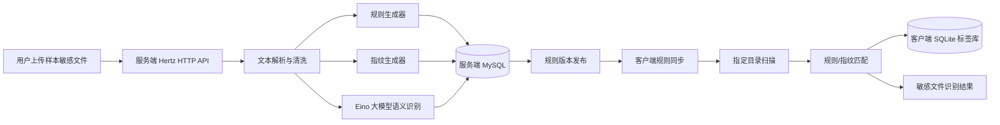
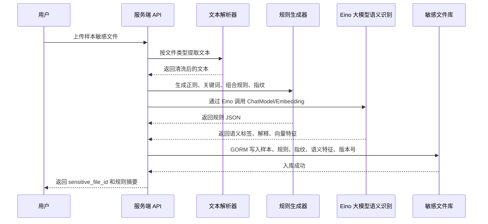
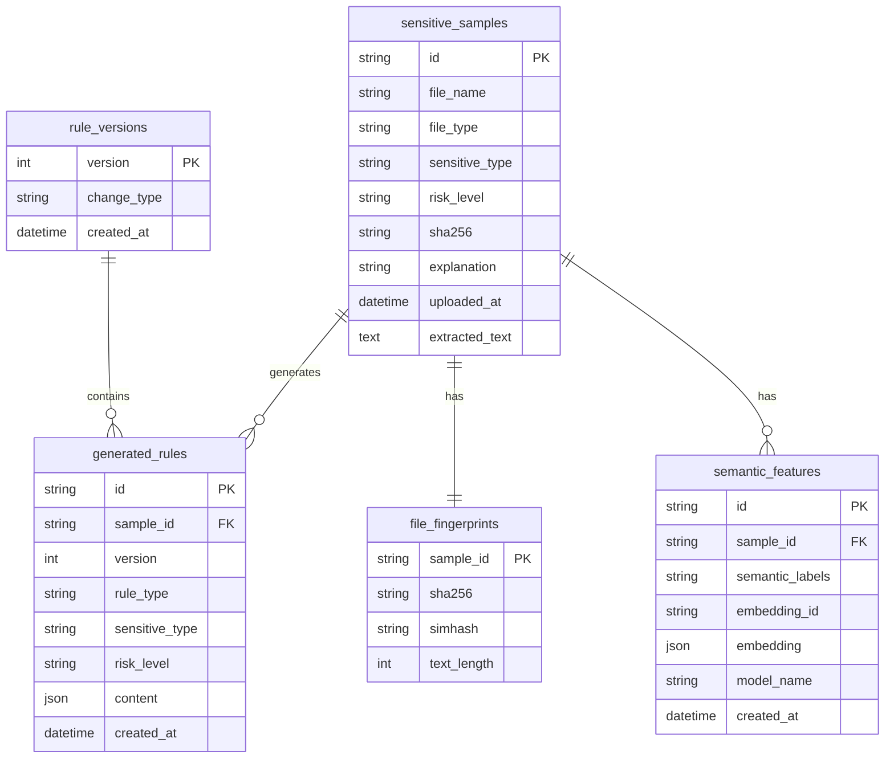
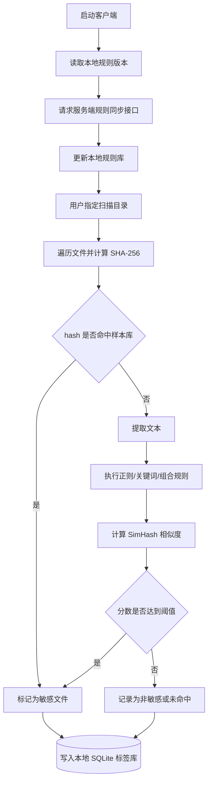

# 模块一方案规划书：敏感文件识别 Agent

## 1. 建设目标

模块一只负责“敏感文件识别”，不负责外发行为监控、告警降噪、统计分析等后续模块。

本模块由服务端和客户端两部分组成：

| 端 | 核心职责 | 输出 |
|---|---|---|
| 服务端 | 接收用户上传的样本敏感文件，解析文本，生成识别规则、语义特征和文件指纹，构建敏感文件库 | 规则库、样本库、语义特征库、版本化敏感文件库 |
| 客户端 | 同步敏感文件库，扫描用户指定目录，识别本地敏感文件并打标 | 本地识别结果、本地 SQLite 标签库 |

最终效果：用户上传一批“已知敏感样本”后，系统能够把样本转化为可执行的识别能力；客户端同步后，可在指定目录中发现相同、相似或包含敏感内容的文件。

## 2. 总体架构



### 2.1 模块边界

本方案只包含以下能力：

- 样本文件上传；
- 文本抽取；
- 敏感规则生成；
- 文件 hash 与 SimHash 指纹生成；
- 基于大模型的文档语义识别和可选向量化；
- 服务端敏感文件库管理；
- 客户端规则同步；
- 指定目录扫描；
- 敏感文件识别与本地标记。

本方案不包含以下能力：

- 监控文件复制、上传、压缩、发送等外发行为；
- 进程行为监控；
- 告警合并、白名单、误报分析；
- 自然语言查询、统计图表、报告生成。

### 2.2 与 `dlpagent.md` 模块一需求逐项对照

| `dlpagent.md` 模块一要求 | 本方案覆盖情况 | 对应章节 |
|---|---|---|
| 服务端上传样本敏感文件，构建敏感文件库 | 已覆盖，服务端上传样本后生成规则、指纹、语义特征并写入 MySQL | 4.1、4.2、4.5 |
| 客户端同步敏感文件库 | 已覆盖，客户端通过 `GET /api/client/rules?version=10` 同步版本化规则库 | 4.5、6.2 |
| 客户端识别指定目录下的敏感文件 | 已覆盖，客户端命令接收目录并执行扫描 | 5.1、5.2 |
| 正则表达式规则 | 已覆盖，内置固定格式敏感信息规则库 | 4.3.1 |
| 关键词规则 | 已覆盖，基于样本文本、用户描述和业务词抽取关键词 | 4.3.2 |
| 文本特征指纹 | 已覆盖，使用 SHA-256 和 SimHash | 4.3.4 |
| 向量化特征，可选 | 已覆盖，使用火山云方舟 Embedding，可接向量库 | 4.3.5 |
| 文本、办公文档、代码文件上传 | 已覆盖，MVP 支持文本、docx、xlsx、pdf、代码文本，PPT/老版 Office 可选扩展 | 4.2 |
| 固定格式敏感信息识别 | 已覆盖，补充身份证、手机号、银行卡、邮箱、地址、车牌、护照号、社保号、税号、统一社会信用代码、密钥、连接串、内网 IP、域名、账号凭证等规则类别 | 4.3.1 |
| 企业业务敏感信息识别 | 已覆盖，使用关键词、组合规则和语义标签识别合同、客户、报价、财务、薪酬、源代码、漏洞、运维账号等 | 4.3.2、4.3.3、4.3.5 |
| 文档语义特征识别 | 已覆盖，使用 ChatModel 分类文档语义，并输出解释 | 4.3.5 |
| 输出 `sensitive_file_id`、规则、指纹、embedding、explanation | 已覆盖，服务端上传接口返回与 `dlpagent.md` 对齐的结构 | 4.4、6.1 |
| 客户端文本提取能力 | 已覆盖，基础格式直接读取，Office/PDF/OCR/压缩包/邮件作为分阶段能力 | 5.5 |
| 敏感文件标记 | 已覆盖，优先使用本地 SQLite、文件 hash、路径辅助标识 | 5.4 |
| 7.1 客户端规则拉取接口 | 已覆盖，沿用 `GET /api/client/rules?version=10` | 4.5、6.2 |
| 7.2、7.3 其他模块接口 | 明确不属于模块一，仅预留后续对接查询/扫描结果接口 | 6.4 |

## 3. 推荐技术选型

### 3.1 技术必要性说明

| 技术 | 是什么 | 模块一是否需要 | 说明 |
|---|---|---|---|
| Hertz | 字节跳动开源的高性能 Go HTTP 框架，用来编写 `POST /samples`、`GET /rules` 等 HTTP 接口 | 必须 | 模块三已使用 Go + Eino，模块一服务端统一 Go 技术栈；Hertz 与 Eino 同属 CloudWeGo 生态，天然兼容 |
| Eino | 字节跳动开源的 Go AI 应用开发框架，编排 ChatModel 和 Embedding 调用 | 必须 | 用于接入火山云方舟 ChatModel / Embedding，实现文档语义识别和向量化 |
| GORM | Go ORM，把数据库表映射成 Go 结构体 | 推荐 | 服务端使用 MySQL，GORM 是 Go 生态最成熟的 ORM，统一管理样本、规则、版本等表结构 |
| go-playground/validator | Go 请求参数校验库 | 推荐 | 配合 Hertz 做 API 入参绑定和校验 |
| zap / logrus | Go 结构化运行日志库 | 推荐 | 这里的日志只用于排查"上传失败、规则同步失败、扫描异常"等运行问题，不是模块二/三的外发告警日志 |

结论：模块一服务端采用 Go 技术栈，`Hertz + Eino + GORM + MySQL` 是核心组合，与模块三的 Go + Eino 统一语言和框架生态。客户端扫描脚本仍可使用 Python，与服务端通过 HTTP API 通信，语言差异由 API 隔离。

### 3.2 服务端技术

| 技术 | 用途 | 选择原因 |
|---|---|---|
| Go 1.22+ | 主开发语言 | 与模块三统一技术栈，Eino/Hertz 生态原生支持 |
| Hertz | HTTP API 服务 | 字节跳动 CloudWeGo 生态高性能 HTTP 框架，与 Eino 天然兼容 |
| Eino | AI 应用编排框架 | 接入火山云方舟 ChatModel / Embedding，实现语义识别和向量化 |
| MySQL | 服务端主数据库 | 明确作为样本库、规则库、指纹库、语义特征库和版本库的持久化数据库 |
| GORM | ORM | Go 生态最成熟 ORM，统一管理样本、规则、版本等数据表 |
| go-sql-driver/mysql | MySQL 驱动 | Go 标准 MySQL 驱动 |
| go-playground/validator | 请求校验 | 配合 Hertz 做入参绑定和校验 |
| hertz-contrib / multipart | 文件上传 | Hertz 接收 multipart 上传文件 |
| gojieba | 中文关键词抽取 | Go 版 jieba，适合从中文样本文档中提取高频业务词 |
| simhash (Go) | 近似文本指纹 | 识别内容被轻微修改后的相似文件 |
| excelize | Excel 文本提取 | Go 生态 xlsx 解析库 |
| unidoc / gopdf | 可选 PDF 文本提取 | Go 生态 PDF 解析库 |
| zap / logrus | 运行日志 | 记录服务启动、文件解析、规则生成、同步异常，便于调试 |

### 3.3 客户端技术

客户端扫描脚本独立于服务端，可以继续使用 Python，与服务端通过 HTTP API 通信。

| 技术 | 用途 | 选择原因 |
|---|---|---|
| Python 3.10+ | 客户端扫描程序 | 跨平台、开发快、文件处理方便 |
| requests / httpx | 同步规则库 | 与服务端 API 通信 |
| SQLite | 本地标签库 | 保存已识别文件、hash、风险等级、更新时间 |
| pathlib / os.walk | 目录遍历 | 扫描指定目录下的文件 |
| hashlib | 文件 hash | 判断完全相同文件 |
| re | 正则匹配 | 执行身份证号、手机号、邮箱、密钥等规则 |
| jieba | 中文文本分词 | 支持关键词匹配和 SimHash 生成 |
| logging / loguru | 运行日志 | 记录目录扫描、文件跳过、规则同步失败等问题 |
| watchdog | 可选增量扫描 | 后续可监听目录变更，MVP 可先手动扫描 |

### 3.4 可选增强技术

| 技术 | 用途 | 使用阶段 |
|---|---|---|
| 火山云方舟 ChatModel / Embedding | 文档语义识别、语义向量相似度识别 | 已通过 Eino 集成，作为核心语义能力 |
| Milvus / FAISS | 向量库 | 后续增强 |
| PaddleOCR | 图片或扫描 PDF OCR | 后续增强 |
| Redis | 规则版本缓存、短期同步状态缓存 | 后续增强 |

## 4. 服务端设计

### 4.1 服务端核心流程



### 4.2 文件上传与文本解析

服务端提供样本上传接口：

```http
POST /api/server/samples
Content-Type: multipart/form-data
```

上传字段建议：

| 字段 | 类型 | 说明 |
|---|---|---|
| file | file | 样本敏感文件 |
| sensitive_type | string | 敏感类型，例如客户资料、财务数据、源代码 |
| risk_level | string | 风险等级，建议 high / medium / low |
| description | string | 用户补充说明 |

文本解析策略：

| 文件类型 | MVP 处理方式 | 后续增强 |
|---|---|---|
| txt / csv / json / xml / md | 直接读取并做编码探测 | 增加乱码修复 |
| docx | 可选，Go 生态 docx 解析库或调用 Python 微服务 | 支持老版 doc |
| xlsx | excelize 提取单元格文本 | 增加公式和多 sheet 优化 |
| pdf | gopdf / unidoc 提取文本 | OCR 识别扫描件 |
| py / java / sql / config | 作为纯文本读取 | 增加代码密钥专项规则 |

### 4.3 规则生成策略

规则生成分为五类：正则规则、关键词规则、组合规则、文件指纹、可选语义向量。

#### 4.3.1 正则规则

正则规则用于识别固定格式敏感信息，建议内置基础规则库：

| 敏感信息 | 示例规则 |
|---|---|
| 身份证号 | `\b\d{17}[\dXx]\b` |
| 手机号 | `\b1[3-9]\d{9}\b` |
| 银行卡号 | `\b\d{16,19}\b`，命中后可增加 Luhn 校验 |
| 邮箱 | `[A-Za-z0-9._%+-]+@[A-Za-z0-9.-]+\.[A-Za-z]{2,}` |
| 地址 | 结合省市区关键词和“路/街/号/栋/单元”等地址后缀识别 |
| 车牌号 | `[\u4e00-\u9fa5][A-Z][A-Z0-9]{5,6}` |
| 护照号 | `[EGPSeps][0-9]{7,8}` |
| 社保号 | `\b\d{9,18}\b`，结合“社保/社会保障”关键词降低误报 |
| 税号 | `[A-Z0-9]{15,20}`，结合“税号/纳税人识别号”关键词 |
| 统一社会信用代码 | `[0-9A-HJ-NPQRTUWXY]{18}` |
| 内网 IP | `\b(10\.\d{1,3}|172\.(1[6-9]|2\d|3[0-1])|192\.168)\.\d{1,3}\.\d{1,3}\b` |
| 域名 | `\b([A-Za-z0-9-]+\.)+[A-Za-z]{2,}\b` |
| API Key | `(?i)(api[_-]?key|access[_-]?token|secret)[\s:=\"]+[A-Za-z0-9_\-]{16,}` |
| Access Token | `(?i)(access[_-]?token|bearer)[\s:=\"]+[A-Za-z0-9._\-]{20,}` |
| 私钥 | `-----BEGIN (RSA |EC |OPENSSH )?PRIVATE KEY-----` |
| 密码 | `(?i)(password|passwd|pwd)[\s:=\"]+[^\s\"]{6,}` |
| 数据库连接串 | `(?i)(jdbc:mysql|postgresql://|mongodb://|redis://)` |
| 账号凭证 | 账号/用户名/密码/Token 等关键词组合出现时命中 |

#### 4.3.2 关键词规则

从样本文本中抽取业务关键词：

1. 对文本做清洗，去除空白、标点、停用词。
2. 使用 `gojieba` 提取 TF-IDF 关键词。
3. 合并用户填写的 `sensitive_type` 和 `description`。
4. 过滤过短、过常见、无业务含义的词。
5. 保存为关键词规则，并设置 `min_hits`。

规则示例：

```json
{
  "rule_name": "客户资料关键词识别",
  "type": "keyword",
  "keywords": ["客户名称", "联系人", "报价", "合同金额", "未公开"],
  "match_mode": "any",
  "min_hits": 2,
  "risk_level": "high"
}
```

#### 4.3.3 组合规则

组合规则用于减少误报。例如“报价”单独出现不一定敏感，但“客户名称 + 报价 + 金额”同时出现时风险更高。

```json
{
  "rule_name": "客户报价单识别",
  "type": "combined",
  "logic": "AND",
  "conditions": [
    { "type": "keyword", "value": ["客户名称", "报价", "合同金额"], "min_hits": 2 },
    { "type": "regex", "value": "\\d+(\\.\\d+)?万元" }
  ],
  "risk_level": "high"
}
```

#### 4.3.4 文件指纹

文件指纹用于识别相同或相似文件：

| 指纹 | 作用 | 匹配方式 |
|---|---|---|
| SHA-256 | 识别完全相同文件 | hash 完全相等 |
| SimHash | 识别内容相似文件 | 汉明距离小于阈值，例如 <= 3 |

#### 4.3.5 大模型语义识别与向量化

`dlpagent.md` 中 3.3.3 要求识别“保密协议、客户名单、财务预算、报价单、薪资明细、研发设计文档、源代码说明、内部培训资料、未公开财报、战略规划”等文档语义。仅靠正则和关键词容易漏掉改写后的表达，因此模块一建议加入大模型语义识别。

语义识别建议做两件事：

1. 使用 ChatModel 对样本文本进行分类，输出 `sensitive_type`、`risk_level`、语义标签和解释说明。
2. 使用 Embedding 模型生成文本向量，写入 MySQL 或向量数据库，后续客户端或服务端可用于相似语义文件识别。

Eino 作为 Go 侧 AI 编排框架，可以直接在服务端代码中调用火山云方舟 ChatModel 和 Embedding，不需要额外跨语言通信。

环境变量只保存占位名，真实密钥不得提交到仓库：

```bash
export ARK_CHAT_MODEL="your-chat-endpoint-id"
export ARK_EMBEDDING_MODEL="your-embedding-endpoint-id"
export ARK_API_KEY="your-api-key"
```

语义识别输出示例：

```json
{
  "semantic_labels": ["客户名单", "报价信息", "商业机密"],
  "sensitive_type": "客户资料/报价信息",
  "risk_level": "high",
  "embedding_id": "emb_001",
  "explanation": "文档包含客户名称、联系人、报价金额和未公开商务信息，属于高敏客户资料。"
}
```

客户端 MVP 阶段可以先不同步完整向量，只同步语义标签和规则；如果后续要做语义相似检索，再增加向量库或服务端语义检索接口。向量维度以所选 embedding 模型为准，规划文档中按 `dlpagent.md` 示例保留 1536 维 float32 的兼容字段。

### 4.4 输出结果结构

服务端完成样本解析、规则生成、指纹生成和语义识别后，应输出与 `dlpagent.md` 3.5 对齐的结果结构：

```json
{
  "sensitive_file_id": "file_001",
  "sensitive_file_name": "2025年度客户报价表.xlsx",
  "sensitive_type": "客户资料/报价信息",
  "risk_level": "high",
  "generated_rules": [
    {
      "type": "keyword",
      "value": ["客户名称", "报价", "联系人", "合同金额"]
    },
    {
      "type": "regex",
      "value": "\\d+(\\.\\d+)?万元"
    }
  ],
  "fingerprint": {
    "hash": "...",
    "simhash": "..."
  },
  "embedding": "可选，建议服务端保存 embedding_id，完整向量存储在 MySQL JSON 字段或向量库",
  "explanation": "文件中包含客户名称、联系人、报价金额等多个敏感字段。"
}
```

### 4.5 规则版本管理

每次新增、修改或删除规则后，服务端生成新的规则版本号。客户端只需要携带本地版本号，服务端判断是否返回增量或全量规则。

```http
GET /api/client/rules?version=10
```

响应示例：

```json
{
  "latest_version": 11,
  "full_sync": false,
  "rules": [
    {
      "rule_id": "rule_001",
      "rule_type": "keyword",
      "sensitive_type": "客户资料",
      "risk_level": "high",
      "content": {
        "keywords": ["客户名称", "报价", "联系人"],
        "min_hits": 2
      }
    }
  ],
  "fingerprints": [
    {
      "sensitive_file_id": "file_001",
      "sha256": "...",
      "simhash": "..."
    }
  ]
}
```

### 4.6 服务端数据库表设计



## 5. 客户端设计

客户端扫描脚本使用 Python 实现，独立于服务端 Go 程序，通过 HTTP API 通信。

### 5.1 客户端核心流程



### 5.2 本地扫描命令设计

客户端可以先实现为命令行工具：

```bash
python client.py sync --server http://127.0.0.1:8080
python client.py scan --path "D:/test_docs" --server http://127.0.0.1:8080
python client.py list --sensitive-only
```

### 5.3 文件识别评分

建议使用可解释的评分模型，方便调试和展示：

| 命中项 | 分数 |
|---|---:|
| SHA-256 完全命中 | 100 |
| SimHash 相似命中 | 70 |
| 高危正则命中 | 30 |
| 普通正则命中 | 15 |
| 关键词达到 `min_hits` | 30 |
| 组合规则命中 | 50 |

识别建议：

| 总分 | 判断 | 风险等级 |
|---:|---|---|
| >= 80 | 敏感文件 | high |
| 50 - 79 | 疑似敏感文件 | medium |
| 30 - 49 | 低置信命中 | low |
| < 30 | 未识别为敏感 | info |

### 5.4 本地标签库设计

客户端使用 SQLite 保存扫描结果，不直接修改原文件内容，避免破坏用户文件。

```sql
CREATE TABLE IF NOT EXISTS local_file_tags (
    id INTEGER PRIMARY KEY AUTOINCREMENT,
    file_path TEXT NOT NULL,
    file_hash TEXT NOT NULL,
    sensitive INTEGER NOT NULL,
    sensitive_type TEXT,
    risk_level TEXT,
    sensitive_file_id TEXT,
    match_score INTEGER,
    match_detail TEXT,
    first_detected_at TEXT,
    last_detected_at TEXT,
    UNIQUE(file_path, file_hash)
);
```

识别结果示例：

```json
{
  "file_path": "D:/test_docs/customer.xlsx",
  "file_hash": "...",
  "sensitive": true,
  "sensitive_type": "客户资料",
  "risk_level": "high",
  "sensitive_file_id": "file_001",
  "match_score": 95,
  "match_detail": {
    "sha256_hit": false,
    "simhash_hit": true,
    "regex_hits": ["phone", "email"],
    "keyword_hits": ["客户名称", "报价", "联系人"]
  },
  "first_detected_at": "2026-06-08 10:00:00",
  "last_detected_at": "2026-06-08 10:00:00"
}
```

### 5.5 客户端文本提取能力

客户端扫描指定目录时，需要先把不同格式文件转换成可匹配文本或可比对特征。能力分为 MVP 和可选增强两层：

| 文件类型 | 处理方式 | 实施阶段 |
|---|---|---|
| txt / csv / json / xml / md | 直接读取，配合 `chardet` 做编码探测 | MVP |
| docx | 使用 `python-docx` 提取段落和表格文本 | MVP |
| xlsx | 使用 `openpyxl` 提取单元格文本 | MVP |
| py / java / go / sql / 配置文件 | 按纯文本读取，并额外执行密钥、连接串、账号凭证规则 | MVP |
| pdf | 使用 `pypdf` 提取文本 | MVP / 增强 |
| doc / xls / ppt / pptx | 使用 Office 解析库或转换服务提取文本 | 可选增强 |
| 图片 | 使用 OCR 提取文字 | 可选增强 |
| 扫描版 PDF | 先转图片再 OCR | 可选增强 |
| zip / rar / 7z | 解压到临时目录后递归扫描，限制最大解压大小和层级 | 可选增强 |
| eml / msg | 提取邮件正文和附件，附件复用文件扫描流程 | 可选增强 |
| 二进制文件 | 不做全文解析，优先使用 SHA-256、元数据和已知指纹匹配 | 可选增强 |

扫描时应跳过过大文件、系统目录、临时文件和无法读取文件，并把跳过原因写入运行日志，避免影响整批扫描。

## 6. API 接口规划

模块一服务端使用 Go + Hertz 实现，与模块三的 Go + Eino 统一技术栈，模块之间通过 JSON API 传递数据，语言完全一致，无需跨语言桥接。

### 6.1 服务端样本上传

```http
POST /api/server/samples
```

返回：

```json
{
  "sensitive_file_id": "file_001",
  "file_name": "2025年度客户报价表.xlsx",
  "sensitive_type": "客户资料/报价信息",
  "risk_level": "high",
  "rule_version": 11,
  "generated_rules_count": 4,
  "fingerprint": {
    "sha256": "...",
    "simhash": "..."
  }
}
```

### 6.2 客户端规则同步

```http
GET /api/client/rules?version=10
```

### 6.3 客户端扫描结果本地查看

MVP 阶段扫描结果保存在客户端 SQLite，不一定需要上报服务端。可以提供本地命令：

```bash
python client.py list
```

如需服务端统一展示，可后续增加：

```http
POST /api/client/scan-results
```

### 6.4 后续模块对接接口建议

模块二、三、四后续可能需要知道“某个文件是否敏感”或“客户端扫描出了哪些敏感文件”。模块一建议预留以下接口：

```http
GET /api/server/sensitive-files/{file_hash}
```

用途：模块二外发监控拿到文件 hash 后，查询该文件是否已被模块一识别为敏感文件。

```http
POST /api/client/scan-results
```

用途：客户端把本地扫描结果同步到服务端，后续模块三/四可以复用识别结果。

接口返回应保持语言无关的 JSON 格式，不暴露 Python 或 Go 内部结构。

## 7. 项目目录建议

```text
SCU-project-model-1/
├── server/
│   ├── main.go
│   ├── router/
│   │   ├── samples.go
│   │   └── rules.go
│   ├── core/
│   │   ├── parser.go
│   │   ├── rule_generator.go
│   │   ├── fingerprint.go
│   │   ├── semantic.go
│   │   └── matcher.go
│   ├── model/
│   │   ├── sample.go
│   │   ├── rule.go
│   │   └── fingerprint.go
│   ├── dal/
│   │   └── mysql.go
│   ├── go.mod
│   └── go.sum
├── client/
│   ├── client.py
│   ├── sync.py
│   ├── scanner.py
│   ├── matcher.py
│   ├── local_db.py
│   └── requirements.txt
├── samples/
│   └── README.md
├── MODULE_ONE_PLAN.md
└── README.md
```

## 8. 实施计划

| 阶段 | 任务 | 交付物 |
|---|---|---|
| 第 1 阶段 | 搭建 Hertz 服务端、MySQL 表结构、样本上传接口 | 可上传样本并入库 |
| 第 2 阶段 | 实现文本解析、基础正则库、gojieba 关键词抽取、SHA-256、SimHash | 可生成规则和指纹 |
| 第 3 阶段 | 集成 Eino 接入火山云方舟 ChatModel/Embedding，实现语义识别 | 可输出语义标签和向量 |
| 第 4 阶段 | 实现规则版本管理和客户端同步接口 | 客户端可拉取规则库 |
| 第 5 阶段 | 实现客户端目录扫描、文本提取、规则匹配、本地 SQLite 标签库 | 可识别指定目录敏感文件 |
| 第 6 阶段 | 准备测试样本、命令行演示、README 使用说明 | 可完整演示模块一闭环 |

## 9. 测试方案

### 9.1 服务端测试

- 上传 txt/xlsx/pdf 样本，确认文本可提取。
- 上传包含手机号、邮箱、API Key 的样本，确认正则规则命中。
- 上传客户报价类文档，确认关键词规则生成合理。
- 上传样本后确认 Eino 语义识别返回语义标签和解释。
- 多次上传样本，确认规则版本号递增。

### 9.2 客户端测试

- 扫描与样本完全相同的文件，确认 SHA-256 命中。
- 修改样本文档少量内容，确认 SimHash 能识别相似文件。
- 扫描包含敏感关键词但文件名不同的文档，确认规则命中。
- 扫描普通文件，确认不会被误标为高危。
- 重复扫描同一目录，确认本地 SQLite 记录更新时间而不是重复插入。

## 10. 安装依赖

### 10.1 服务端依赖（Go）

```bash
cd server
go mod init server
go get github.com/cloudwego/hertz
go get github.com/cloudwego/eino
go get gorm.io/gorm
go get gorm.io/driver/mysql
go get github.com/go-sql-driver/mysql
go get github.com/go-playground/validator/v10
go get github.com/yanyiwu/gojieba
go get github.com/cloudwego/hertz/pkg/app
go get github.com/cloudwego/hertz/pkg/app/server
go get github.com/cloudwego/hertz/pkg/protocol
go get go.uber.org/zap
go get github.com/xuri/excelize/v2
```

启动命令：

```bash
cd server
go run main.go
# 默认监听 :8080
```

环境变量配置（语义识别必需）：

```bash
export ARK_CHAT_MODEL="your-chat-endpoint-id"
export ARK_EMBEDDING_MODEL="your-embedding-endpoint-id"
export ARK_API_KEY="your-api-key"
```

注意：真实 `ARK_API_KEY` 只能放在本机环境变量、`.env` 或部署平台密钥管理中，不能提交到 GitHub。

### 10.2 客户端依赖

建议 `client/requirements.txt`：

```txt
requests==2.32.3
jieba==0.42.1
simhash==2.1.2
openpyxl==3.1.5
pypdf==4.3.1
chardet==5.2.0
watchdog==4.0.2
loguru==0.7.2
```

安装命令：

```bash
cd client
python -m venv .venv
.venv/Scripts/activate
pip install -r requirements.txt
python client.py sync --server http://127.0.0.1:8080
python client.py scan --path "D:/test_docs" --server http://127.0.0.1:8080
```

## 11. 技术总结

本模块采用"服务端 Go 生成规则 + 客户端 Python 本地识别"的架构。

服务端使用 Go、Hertz、Eino、MySQL、GORM、gojieba、SimHash 等技术，将用户上传的敏感样本转化为规则库、指纹库和语义特征库，并通过版本化接口提供给客户端同步。Eino 作为 Go 侧 AI 编排框架，直接在服务端代码中调用火山云方舟 ChatModel / Embedding，无需跨语言通信。

客户端使用 Python、requests、SQLite、hashlib、re、jieba、SimHash 等技术，在终端本地扫描指定目录，通过 hash 精确匹配、SimHash 相似匹配、正则匹配、关键词匹配、组合规则评分和语义标签识别敏感文件。客户端与服务端通过 HTTP API 通信，语言差异由 API 隔离。

该方案优点是与模块三统一 Go + Eino 技术栈，服务端无跨语言开销；客户端保留 Python 生态的文档处理便利性。适合作为课程项目模块一的 MVP。后续如果需要提升识别准确率，可以加入 OCR、语义向量、向量数据库和增量目录监听等增强能力。
