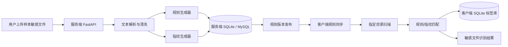
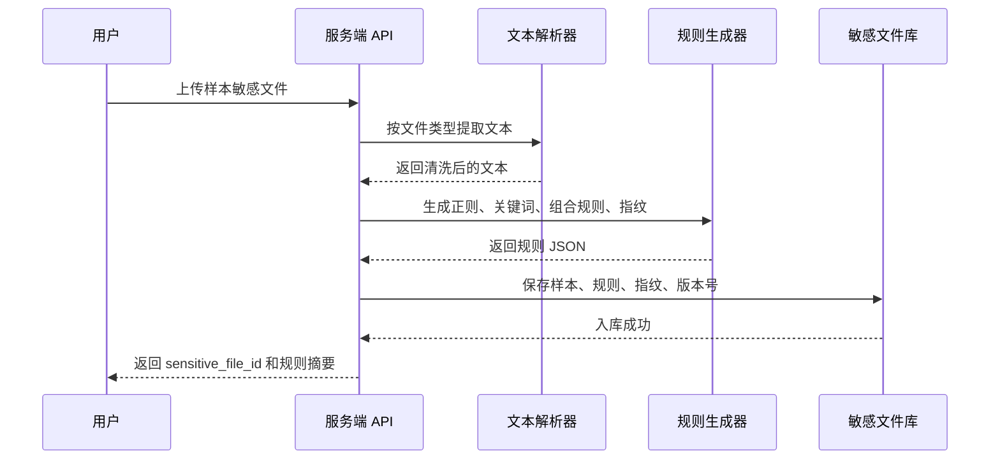
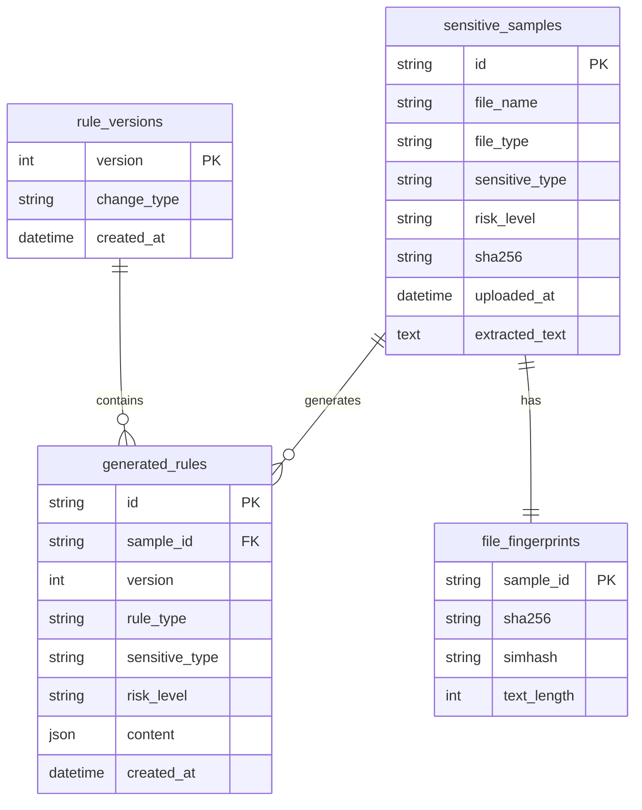
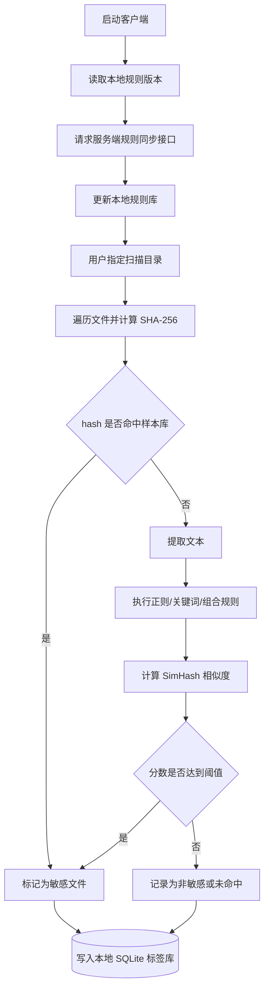

# 模块一方案规划书：敏感文件识别 Agent

## 1. 建设目标

模块一只负责“敏感文件识别”，不负责外发行为监控、告警降噪、统计分析等后续模块。

本模块由服务端和客户端两部分组成：

| 端 | 核心职责 | 输出 |
|---|---|---|
| 服务端 | 接收用户上传的样本敏感文件，解析文本，生成识别规则和文件指纹，构建敏感文件库 | 规则库、样本库、版本化敏感文件库 |
| 客户端 | 同步敏感文件库，扫描用户指定目录，识别本地敏感文件并打标 | 本地识别结果、本地 SQLite 标签库 |

最终效果：用户上传一批“已知敏感样本”后，系统能够把样本转化为可执行的识别能力；客户端同步后，可在指定目录中发现相同、相似或包含敏感内容的文件。

## 2. 总体架构



### 2.1 模块边界

本方案只包含以下能力：

- 样本文件上传；
- 文本抽取；
- 敏感规则生成；
- 文件 hash 与 SimHash 指纹生成；
- 服务端敏感文件库管理；
- 客户端规则同步；
- 指定目录扫描；
- 敏感文件识别与本地标记。

本方案不包含以下能力：

- 监控文件复制、上传、压缩、发送等外发行为；
- 进程行为监控；
- 告警合并、白名单、误报分析；
- 自然语言查询、统计图表、报告生成。

## 3. 推荐技术选型

### 3.1 服务端技术

| 技术 | 用途 | 选择原因 |
|---|---|---|
| Python 3.10+ | 主开发语言 | 文档解析、文本处理、规则生成生态完整 |
| FastAPI | HTTP API 服务 | 轻量、接口文档自动生成、适合前后端/客户端联调 |
| Uvicorn | ASGI 运行器 | FastAPI 标准运行方式 |
| SQLite | MVP 数据库 | 部署简单，适合课程项目快速落地 |
| SQLAlchemy | ORM | 统一管理样本、规则、版本等数据表 |
| Pydantic | 数据校验 | 约束 API 请求和响应结构 |
| python-multipart | 文件上传 | 支持 FastAPI 接收 multipart 文件 |
| jieba | 中文关键词抽取 | 适合从中文样本文档中提取高频业务词 |
| simhash | 近似文本指纹 | 识别内容被轻微修改后的相似文件 |
| python-docx / openpyxl / pypdf | 可选文档解析 | 支持 Word、Excel、PDF 文本提取 |

### 3.2 客户端技术

| 技术 | 用途 | 选择原因 |
|---|---|---|
| Python 3.10+ | 客户端扫描程序 | 跨平台、开发快、文件处理方便 |
| requests / httpx | 同步规则库 | 与服务端 API 通信 |
| SQLite | 本地标签库 | 保存已识别文件、hash、风险等级、更新时间 |
| pathlib / os.walk | 目录遍历 | 扫描指定目录下的文件 |
| hashlib | 文件 hash | 判断完全相同文件 |
| re | 正则匹配 | 执行身份证号、手机号、邮箱、密钥等规则 |
| jieba | 中文文本分词 | 支持关键词匹配和 SimHash 生成 |
| watchdog | 可选增量扫描 | 后续可监听目录变更，MVP 可先手动扫描 |

### 3.3 可选增强技术

| 技术 | 用途 | 使用阶段 |
|---|---|---|
| sentence-transformers / OpenAI Embeddings | 语义向量相似度识别 | 后续增强 |
| FAISS / Chroma | 向量库 | 后续增强 |
| pytesseract / PaddleOCR | 图片或扫描 PDF OCR | 后续增强 |
| MySQL / PostgreSQL | 多用户服务端数据库 | 项目扩展阶段 |

## 4. 服务端设计

### 4.1 服务端核心流程



### 4.2 文件上传与文本解析

服务端提供样本上传接口：

```http
POST /api/server/samples
Content-Type: multipart/form-data
```

上传字段建议：

| 字段 | 类型 | 说明 |
|---|---|---|
| file | file | 样本敏感文件 |
| sensitive_type | string | 敏感类型，例如客户资料、财务数据、源代码 |
| risk_level | string | 风险等级，建议 high / medium / low |
| description | string | 用户补充说明 |

文本解析策略：

| 文件类型 | MVP 处理方式 | 后续增强 |
|---|---|---|
| txt / csv / json / xml / md | 直接读取并做编码探测 | 增加乱码修复 |
| docx | python-docx 提取段落和表格文本 | 支持老版 doc |
| xlsx | openpyxl 提取单元格文本 | 增加公式和多 sheet 优化 |
| pdf | pypdf 提取文本 | OCR 识别扫描件 |
| py / java / sql / config | 作为纯文本读取 | 增加代码密钥专项规则 |

### 4.3 规则生成策略

规则生成分为四类：正则规则、关键词规则、组合规则、文件指纹。

#### 4.3.1 正则规则

正则规则用于识别固定格式敏感信息，建议内置基础规则库：

| 敏感信息 | 示例规则 |
|---|---|
| 身份证号 | `\b\d{17}[\dXx]\b` |
| 手机号 | `\b1[3-9]\d{9}\b` |
| 邮箱 | `[A-Za-z0-9._%+-]+@[A-Za-z0-9.-]+\.[A-Za-z]{2,}` |
| 内网 IP | `\b(10\.\d{1,3}|172\.(1[6-9]|2\d|3[0-1])|192\.168)\.\d{1,3}\.\d{1,3}\b` |
| API Key | `(?i)(api[_-]?key|access[_-]?token|secret)[\s:=\"]+[A-Za-z0-9_\-]{16,}` |
| 数据库连接串 | `(?i)(jdbc:mysql|postgresql://|mongodb://|redis://)` |

#### 4.3.2 关键词规则

从样本文本中抽取业务关键词：

1. 对文本做清洗，去除空白、标点、停用词。
2. 使用 `jieba.analyse.extract_tags` 提取 TF-IDF 关键词。
3. 合并用户填写的 `sensitive_type` 和 `description`。
4. 过滤过短、过常见、无业务含义的词。
5. 保存为关键词规则，并设置 `min_hits`。

规则示例：

```json
{
  "rule_name": "客户资料关键词识别",
  "type": "keyword",
  "keywords": ["客户名称", "联系人", "报价", "合同金额", "未公开"],
  "match_mode": "any",
  "min_hits": 2,
  "risk_level": "high"
}
```

#### 4.3.3 组合规则

组合规则用于减少误报。例如“报价”单独出现不一定敏感，但“客户名称 + 报价 + 金额”同时出现时风险更高。

```json
{
  "rule_name": "客户报价单识别",
  "type": "combined",
  "logic": "AND",
  "conditions": [
    { "type": "keyword", "value": ["客户名称", "报价", "合同金额"], "min_hits": 2 },
    { "type": "regex", "value": "\\d+(\\.\\d+)?万元" }
  ],
  "risk_level": "high"
}
```

#### 4.3.4 文件指纹

文件指纹用于识别相同或相似文件：

| 指纹 | 作用 | 匹配方式 |
|---|---|---|
| SHA-256 | 识别完全相同文件 | hash 完全相等 |
| SimHash | 识别内容相似文件 | 汉明距离小于阈值，例如 <= 3 |

### 4.4 规则版本管理

每次新增、修改或删除规则后，服务端生成新的规则版本号。客户端只需要携带本地版本号，服务端判断是否返回增量或全量规则。

```http
GET /api/client/rules?version=10
```

响应示例：

```json
{
  "latest_version": 11,
  "full_sync": false,
  "rules": [
    {
      "rule_id": "rule_001",
      "rule_type": "keyword",
      "sensitive_type": "客户资料",
      "risk_level": "high",
      "content": {
        "keywords": ["客户名称", "报价", "联系人"],
        "min_hits": 2
      }
    }
  ],
  "fingerprints": [
    {
      "sensitive_file_id": "file_001",
      "sha256": "...",
      "simhash": "..."
    }
  ]
}
```

### 4.5 服务端数据库表设计



## 5. 客户端设计

### 5.1 客户端核心流程



### 5.2 本地扫描命令设计

客户端可以先实现为命令行工具：

```bash
python client.py sync --server http://127.0.0.1:8000
python client.py scan --path "D:/test_docs" --server http://127.0.0.1:8000
python client.py list --sensitive-only
```

### 5.3 文件识别评分

建议使用可解释的评分模型，方便调试和展示：

| 命中项 | 分数 |
|---|---:|
| SHA-256 完全命中 | 100 |
| SimHash 相似命中 | 70 |
| 高危正则命中 | 30 |
| 普通正则命中 | 15 |
| 关键词达到 `min_hits` | 30 |
| 组合规则命中 | 50 |

识别建议：

| 总分 | 判断 | 风险等级 |
|---:|---|---|
| >= 80 | 敏感文件 | high |
| 50 - 79 | 疑似敏感文件 | medium |
| 30 - 49 | 低置信命中 | low |
| < 30 | 未识别为敏感 | info |

### 5.4 本地标签库设计

客户端使用 SQLite 保存扫描结果，不直接修改原文件内容，避免破坏用户文件。

```sql
CREATE TABLE IF NOT EXISTS local_file_tags (
    id INTEGER PRIMARY KEY AUTOINCREMENT,
    file_path TEXT NOT NULL,
    file_hash TEXT NOT NULL,
    sensitive INTEGER NOT NULL,
    sensitive_type TEXT,
    risk_level TEXT,
    sensitive_file_id TEXT,
    match_score INTEGER,
    match_detail TEXT,
    first_detected_at TEXT,
    last_detected_at TEXT,
    UNIQUE(file_path, file_hash)
);
```

识别结果示例：

```json
{
  "file_path": "D:/test_docs/customer.xlsx",
  "file_hash": "...",
  "sensitive": true,
  "sensitive_type": "客户资料",
  "risk_level": "high",
  "sensitive_file_id": "file_001",
  "match_score": 95,
  "match_detail": {
    "sha256_hit": false,
    "simhash_hit": true,
    "regex_hits": ["phone", "email"],
    "keyword_hits": ["客户名称", "报价", "联系人"]
  },
  "first_detected_at": "2026-06-08 10:00:00",
  "last_detected_at": "2026-06-08 10:00:00"
}
```

## 6. API 接口规划

### 6.1 服务端样本上传

```http
POST /api/server/samples
```

返回：

```json
{
  "sensitive_file_id": "file_001",
  "file_name": "2025年度客户报价表.xlsx",
  "sensitive_type": "客户资料/报价信息",
  "risk_level": "high",
  "rule_version": 11,
  "generated_rules_count": 4,
  "fingerprint": {
    "sha256": "...",
    "simhash": "..."
  }
}
```

### 6.2 客户端规则同步

```http
GET /api/client/rules?version=10
```

### 6.3 客户端扫描结果本地查看

MVP 阶段扫描结果保存在客户端 SQLite，不一定需要上报服务端。可以提供本地命令：

```bash
python client.py list
```

如需服务端统一展示，可后续增加：

```http
POST /api/client/scan-results
```

## 7. 项目目录建议

```text
SCU-project-model-1/
├── server/
│   ├── app.py
│   ├── api/
│   │   ├── samples.py
│   │   └── rules.py
│   ├── core/
│   │   ├── parser.py
│   │   ├── rule_generator.py
│   │   ├── fingerprint.py
│   │   └── matcher.py
│   ├── models.py
│   ├── database.py
│   └── requirements.txt
├── client/
│   ├── client.py
│   ├── sync.py
│   ├── scanner.py
│   ├── matcher.py
│   ├── local_db.py
│   └── requirements.txt
├── samples/
│   └── README.md
├── MODULE_ONE_PLAN.md
└── README.md
```

## 8. 实施计划

| 阶段 | 任务 | 交付物 |
|---|---|---|
| 第 1 阶段 | 搭建 FastAPI 服务端、SQLite 表结构、样本上传接口 | 可上传样本并入库 |
| 第 2 阶段 | 实现文本解析、基础正则库、关键词抽取、SHA-256、SimHash | 可生成规则和指纹 |
| 第 3 阶段 | 实现规则版本管理和客户端同步接口 | 客户端可拉取规则库 |
| 第 4 阶段 | 实现客户端目录扫描、文本提取、规则匹配、本地 SQLite 标签库 | 可识别指定目录敏感文件 |
| 第 5 阶段 | 准备测试样本、命令行演示、README 使用说明 | 可完整演示模块一闭环 |

## 9. 测试方案

### 9.1 服务端测试

- 上传 txt/docx/xlsx/pdf 样本，确认文本可提取。
- 上传包含手机号、邮箱、API Key 的样本，确认正则规则命中。
- 上传客户报价类文档，确认关键词规则生成合理。
- 多次上传样本，确认规则版本号递增。

### 9.2 客户端测试

- 扫描与样本完全相同的文件，确认 SHA-256 命中。
- 修改样本文档少量内容，确认 SimHash 能识别相似文件。
- 扫描包含敏感关键词但文件名不同的文档，确认规则命中。
- 扫描普通文件，确认不会被误标为高危。
- 重复扫描同一目录，确认本地 SQLite 记录更新时间而不是重复插入。

## 10. 安装依赖

### 10.1 服务端依赖

建议 `server/requirements.txt`：

```txt
fastapi==0.115.0
uvicorn[standard]==0.30.6
python-multipart==0.0.9
sqlalchemy==2.0.34
pydantic==2.8.2
jieba==0.42.1
simhash==2.1.2
python-docx==1.1.2
openpyxl==3.1.5
pypdf==4.3.1
chardet==5.2.0
```

安装命令：

```bash
cd server
python -m venv .venv
.venv/Scripts/activate
pip install -r requirements.txt
uvicorn app:app --reload --host 127.0.0.1 --port 8000
```

### 10.2 客户端依赖

建议 `client/requirements.txt`：

```txt
requests==2.32.3
jieba==0.42.1
simhash==2.1.2
python-docx==1.1.2
openpyxl==3.1.5
pypdf==4.3.1
chardet==5.2.0
watchdog==4.0.2
```

安装命令：

```bash
cd client
python -m venv .venv
.venv/Scripts/activate
pip install -r requirements.txt
python client.py sync --server http://127.0.0.1:8000
python client.py scan --path "D:/test_docs" --server http://127.0.0.1:8000
```

## 11. 技术总结

本模块采用“服务端生成规则 + 客户端本地识别”的架构。

服务端使用 Python、FastAPI、SQLite、SQLAlchemy、jieba、SimHash 等技术，将用户上传的敏感样本转化为规则库和指纹库，并通过版本化接口提供给客户端同步。客户端使用 Python、requests、SQLite、hashlib、re、jieba、SimHash 等技术，在终端本地扫描指定目录，通过 hash 精确匹配、SimHash 相似匹配、正则匹配、关键词匹配和组合规则评分识别敏感文件。

该方案优点是实现成本低、演示闭环清晰、识别过程可解释，适合作为课程项目模块一的 MVP。后续如果需要提升识别准确率，可以加入 OCR、语义向量、向量数据库和增量目录监听等增强能力。

